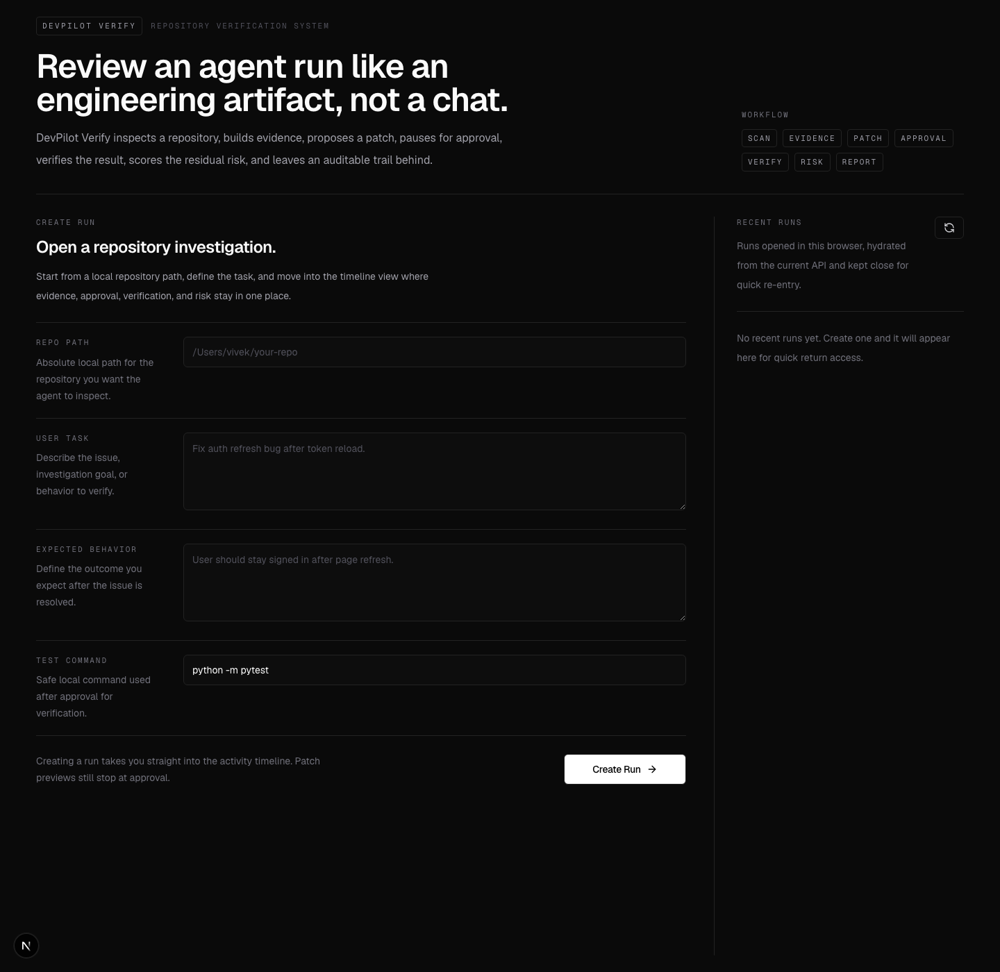
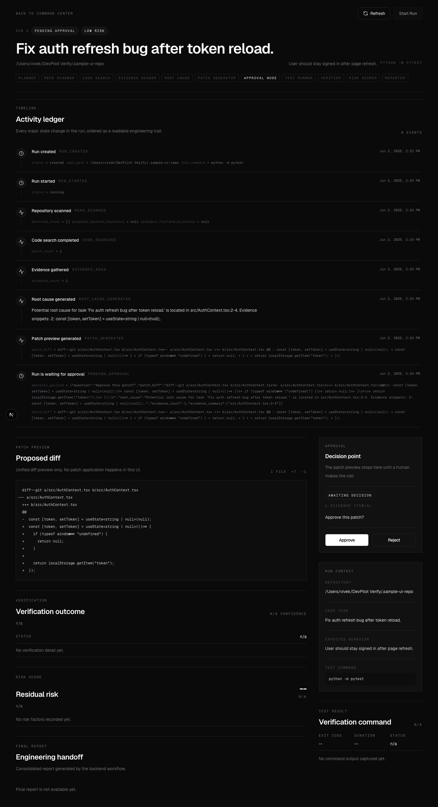
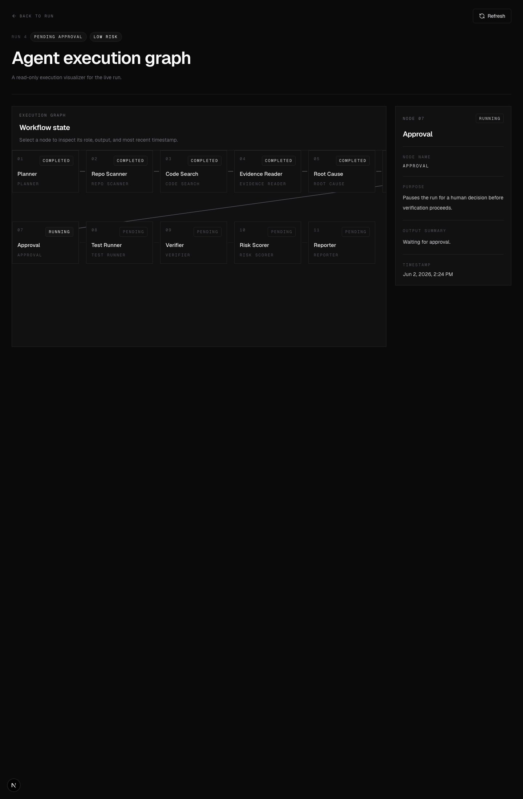
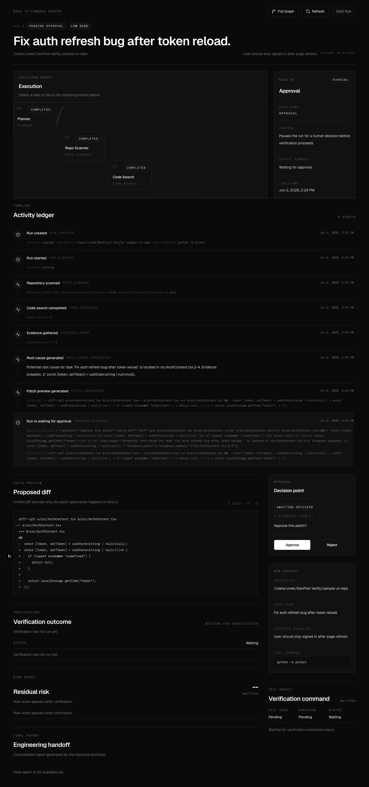
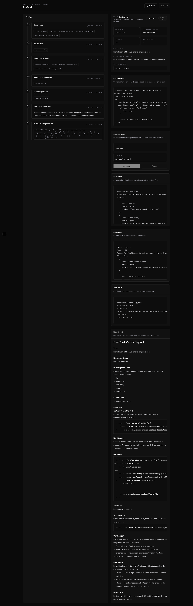

# Agentrail

Verification-first AI software engineering agent for safe, evidence-backed bug fixes.

Repository: [vivekvx/Agentrail](https://github.com/vivekvx/Agentrail)

Agentrail analyzes real repositories, finds evidence, explains root cause, proposes a fix strategy, generates a patch preview, pauses for human approval, runs tests safely, verifies the result, scores risk, and produces a final engineering report. It is a local/portfolio MVP with production-minded safety design, not a fully autonomous production coding system.

## Why This Exists

AI coding tools can generate code quickly, but generated code still needs evidence, human approval, test execution, verification, risk scoring, and review-ready reporting. Agentrail is built around that missing engineering loop.

This project is not another coding chatbot. It treats repository contents and model output as untrusted, records how conclusions were reached, shows patch previews before any approval step, runs allowlisted verification commands, and reports residual risk.

## Core Workflow

```text
repo input
-> scan
-> search
-> evidence
-> root cause
-> fix strategy
-> patch preview
-> approval
-> test runner
-> verifier
-> risk scorer
-> report
```

## Screenshots

Current screenshots live in `frontend/artifacts/`. Before publishing, copy the latest curated images into `docs/screenshots/` using the names listed in [docs/screenshots/README.md](docs/screenshots/README.md).

| View | Current artifact |
| --- | --- |
| Dashboard |  |
| Run detail |  |
| Agent graph |  |
| Patch approval |  |
| Verification and risk |  |

## Key Features

### Agent Workflow

- LangGraph pipeline with explicit planner, scanner, search, evidence, root-cause, fix-strategy, patch-preview, approval, test, verifier, risk, and reporter nodes.
- Event timeline API for auditable run history.
- Visual graph UI for inspecting the workflow shape.

### Evidence-Grounded Analysis

- Repository scanner for FastAPI, React, Next.js, package files, and candidate test commands.
- Code search with recorded query results and file matches.
- Line-numbered evidence snippets from inspected files.
- Optional structured LLM root-cause analysis with deterministic fallback.
- Optional structured LLM fix strategy that advises the patch generator without directly generating code.

### Human-in-the-Loop Safety

- LangGraph approval interrupt before test execution continues.
- Patch preview only; Agentrail does not apply patches to the original repository.
- Approval and rejection states are persisted for review.

### Verification

- Local safe test runner remains the default.
- Optional E2B sandbox adapter can run allowlisted tests in an isolated cloud sandbox when configured.
- Verifier summarizes whether evidence, approval, patch preview, and tests support the result.
- Risk scorer explains residual risk with concrete factors.

### Developer Experience

- Local repository input and public GitHub repository import.
- Public GitHub issue URL import to prefill repository URL and task context.
- Monochrome developer dashboard for run creation, timeline, graph, patch preview, verification, risk, and report views.
- Final report suitable for PR descriptions, issue updates, or engineering handoff.
- PR draft export with copy-ready title and Markdown body.
- Deterministic project-specific eval suite for checking workflow behavior across controlled fixtures.

## Tech Stack

Backend:

- FastAPI
- Python
- LangGraph
- Pydantic v2
- SQLAlchemy
- SQLite for local development and PostgreSQL-compatible persistence
- OpenAI structured output support
- Optional E2B sandbox adapter

Frontend:

- Next.js App Router
- React
- TypeScript
- Tailwind CSS
- shadcn-style local UI primitives
- React Flow via `@xyflow/react`
- Monochrome developer-tool UI

Tooling:

- pytest
- npm lint/build
- git
- ripgrep-style search path with Python fallback when `rg` is unavailable

## Architecture

```text
Frontend
-> FastAPI API
-> LangGraph workflow
-> repo tools / search / evidence
-> optional LLM provider
-> patch preview
-> approval interrupt
-> test runner: local or E2B
-> verifier / risk scorer
-> report / timeline
```

More detail: [docs/ARCHITECTURE.md](docs/ARCHITECTURE.md).

## Safety Model

- Does not apply patches to the original repository.
- Generates patch preview only.
- Requires human approval before continuing past the approval interrupt.
- Reuses a command allowlist for verification commands.
- Runs local commands with `shell=False`.
- Defaults to the local safe runner.
- Uses optional E2B sandbox execution only when enabled and configured.
- Filters secret-like files from sandbox archives.
- Sanitizes errors before API responses and run events.
- Avoids token logging.
- Public GitHub import is read-only and does not create commits or pull requests.

More detail: [docs/SAFETY_MODEL.md](docs/SAFETY_MODEL.md).

## Setup

Backend:

```bash
cd backend
uv sync --extra dev
uv run uvicorn app.main:app --reload
```

Frontend:

```bash
cd frontend
npm install
npm run dev
```

Tests:

```bash
cd backend
PYTHONDONTWRITEBYTECODE=1 uv run --isolated --extra dev pytest -p no:cacheprovider

cd frontend
npm run lint
npm run build
```

Evals:

```bash
cd backend
uv run python -m app.evals.runner
```

The eval suite is not SWE-bench. It is a small deterministic regression suite for validating Agentrail behavior: repo scan, search, evidence, root-cause grounding, patch-preview grounding, approval interrupt, test result handling, verifier status, risk level, and report sections.

## Environment Variables

| Variable | Purpose |
| --- | --- |
| `OPENAI_API_KEY` | Optional key for structured LLM root-cause and fix-strategy analysis. |
| `OPENAI_MODEL` | Optional model override for LLM-backed analysis. |
| `LLM_ROOT_CAUSE_ENABLED` | Enables structured LLM root-cause analysis when true. |
| `LLM_FIX_STRATEGY_ENABLED` | Enables structured LLM fix strategy when true. |
| `E2B_ENABLED` | Enables the optional E2B sandbox runner when true. |
| `E2B_API_KEY` | Optional key required only when E2B sandbox execution is enabled. |
| `AGENTRAIL_API_BASE_URL` | Frontend proxy target for the FastAPI backend when deployed separately. |
| `AGENTRAIL_ALLOWED_REPO_ROOTS` | Optional path allowlist for local repository access. |
| `REPO_WORKSPACE_DIR` | Controlled workspace for imported GitHub repositories. |
| `GITHUB_IMPORT_ENABLED` | Enables public GitHub repository import when true. |
| `GITHUB_ISSUE_IMPORT_ENABLED` | Enables read-only public GitHub issue import when true. |
| `GITHUB_API_TIMEOUT_SECONDS` | Timeout for GitHub issue API requests. |
| `GITHUB_TOKEN` | Optional token for GitHub clone access; never required for public MVP flow. |
| `MAX_ISSUE_BODY_CHARS` | Maximum issue body length copied into run context. |

LLM features are optional. E2B is optional. The local deterministic workflow works without external API keys.

## Deployment

Frontend deployment target: [agentrail.vercel.app](https://agentrail.vercel.app).

The Vercel deployment serves the Agentrail UI and static product pages. Set `AGENTRAIL_API_BASE_URL` in Vercel when a public backend is available.

## API Overview

- `POST /api/runs`
- `POST /api/runs/{run_id}/start`
- `GET /api/runs/{run_id}`
- `GET /api/runs/{run_id}/approval`
- `POST /api/runs/{run_id}/approve`
- `POST /api/runs/{run_id}/reject`
- `GET /api/runs/{run_id}/pr-draft`
- `GET /api/runs/{run_id}/events`

## Demo Flow

1. Create a run with a public GitHub repository URL or local repository path.
2. Or paste a public GitHub issue URL to prefill the repository URL, title/body task context, labels, state, and author metadata.
3. Start the run.
4. Watch the event timeline populate.
5. Review root cause and fix strategy.
6. Inspect the patch preview.
7. Approve or reject the patch preview.
8. Run tests locally or via optional E2B sandboxing.
9. Read the verification result.
10. Read the risk score.
11. Read the final report.
12. Generate a PR draft and copy the title/body into a manual pull request.

GitHub issue demo flow:

```text
GitHub issue URL
-> read-only issue import
-> repository import
-> evidence-backed analysis
-> patch preview
-> approval
-> verification / risk
-> report
-> PR draft export
```

Demo scripts: [docs/DEMO_SCRIPT.md](docs/DEMO_SCRIPT.md).

## Roadmap

- Completed: Evaluation suite
- Completed: GitHub issue import
- Completed: PR draft export
- Later: durable LangGraph checkpointing
- Later: real PR creation
- Later: deeper CI integration
- Later: multi-repo benchmarks

Detailed roadmap: [docs/ROADMAP.md](docs/ROADMAP.md).

## Resume Bullets

- Built Agentrail, a verification-first AI software engineering agent using FastAPI, LangGraph, Next.js, structured LLM outputs, and optional E2B sandboxing.
- Designed a LangGraph workflow for repository scanning, planning, code search, evidence extraction, root-cause analysis, fix strategy generation, patch preview, human approval, test execution, verification, risk scoring, and report generation.
- Implemented safety guardrails including patch-preview-only workflow, human approval interrupts, command allowlisting, secret filtering, sanitized errors, read-only GitHub import, and optional isolated sandbox execution.
- Built a monochrome developer dashboard with run creation, event timeline, visual execution graph, patch approval, verification results, risk scoring, and final engineering reports.
- Added deterministic fallback paths for local development and tests while keeping optional LLM and E2B integrations behind explicit configuration.

More variants: [docs/RESUME_BULLETS.md](docs/RESUME_BULLETS.md).

## PR Draft Export

Completed or in-progress runs can generate a copy-ready pull request draft. The draft includes title, summary, linked issue, root cause, fix strategy, patch preview files, verification status, test evidence, risk level, rollback plan, and manual review checklist.

This does not create a GitHub PR, push a branch, commit code, or modify the original repository.
