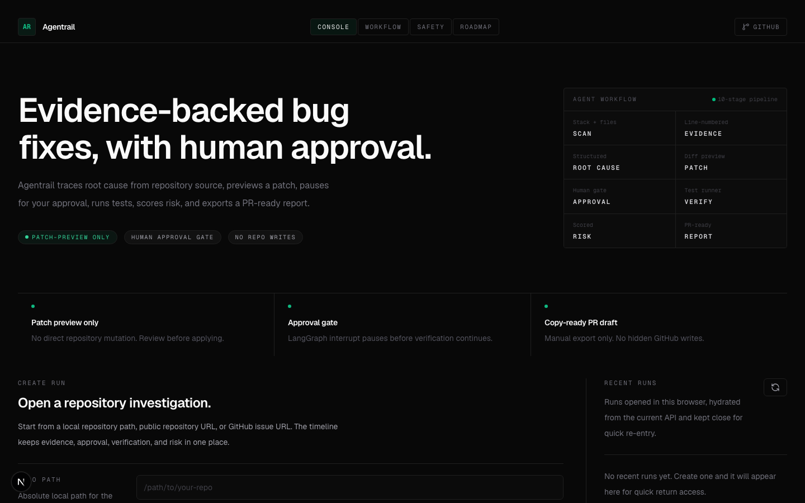
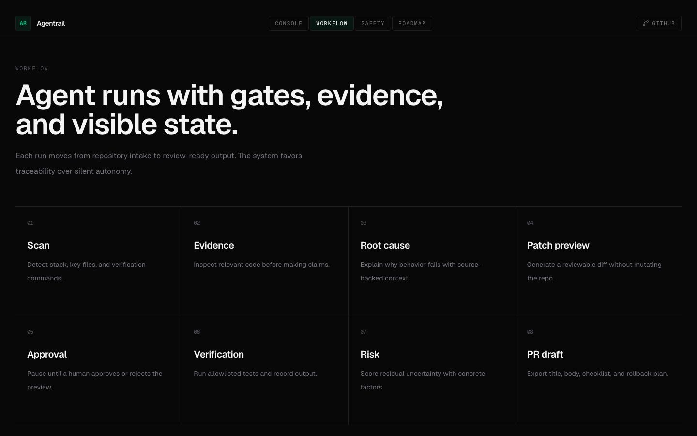

# Agentrail

**Verification-first AI software engineering agent for evidence-backed bug fixes.**


Agentrail analyzes repositories, finds code evidence, explains root cause, proposes a fix strategy, previews a patch, pauses for human approval, runs tests safely, verifies the result, scores risk, and generates a PR-ready report.

It is a local/portfolio MVP with production-minded safety design: useful as a developer-tool showcase, honest about its boundaries, and intentionally not a fully autonomous production coding system.

<p align="center">
  
  
  
</p>

See the [demo script](docs/DEMO_SCRIPT.md) for the full walkthrough.

## What Agentrail Does

| Stage | Output |
| --- | --- |
| Repository scan | Stack, files, test commands |
| Evidence search | Relevant files and line-numbered snippets |
| Root cause | Structured explanation grounded in evidence |
| Fix strategy | High-level plan constrained to evidence |
| Patch preview | Diff preview, not automatic modification |
| Human approval | LangGraph interrupt before verification |
| Test runner | Local safe runner or optional E2B sandbox |
| Verification | Verified, not verified, or manual review |
| Risk scoring | Residual risk with concrete factors |
| PR draft | Copy-ready PR title and Markdown body |

## Core Workflow

```text
repo path / repo URL / issue URL
-> scan
-> search
-> evidence
-> root cause
-> fix strategy
-> patch preview
-> approval
-> test runner
-> verifier
-> risk scorer
-> final report
-> PR draft export
```

## Safety by Design

Agentrail does not directly modify the original repository. It produces evidence, patch previews, verification results, and PR drafts so a developer can review the change before applying it.

- Patch-preview-only workflow
- Human approval before verification continues
- Command allowlist with `shell=False`
- Secret-file filtering for sandbox uploads
- Optional isolated E2B sandbox runner
- Read-only public GitHub issue and repository import
- Sanitized errors and token handling

Read the detailed safety notes in [docs/SAFETY_MODEL.md](docs/SAFETY_MODEL.md).

## Key Features

- Explicit LangGraph workflow with planner, scanner, search, evidence, root-cause, fix-strategy, patch-preview, approval, test, verifier, risk, and reporter nodes.
- Repository scanner for FastAPI, React, Next.js, package files, and candidate test commands.
- Line-numbered evidence records from inspected source, tests, configs, logs, or command output.
- Optional structured LLM root-cause and fix-strategy analysis with deterministic fallback paths.
- Local allowlisted test runner by default, with optional E2B sandbox execution when configured.
- Run timeline, visual workflow graph, verification panels, risk scoring, final report, and PR draft export.
- Deterministic project-specific eval suite for regression testing the workflow.

## Quickstart

### Backend

```bash
cd backend
uv sync --extra dev
uv run uvicorn app.main:app --reload
```

### Frontend

```bash
cd frontend
npm install
npm run dev
```

### Tests

```bash
cd backend
PYTHONDONTWRITEBYTECODE=1 uv run --isolated --extra dev pytest -p no:cacheprovider

cd frontend
npm run lint
npm run build
```

## Evaluation

Agentrail includes a small deterministic evaluation suite. It is not SWE-bench; it is a project-specific regression suite for validating workflow behavior across controlled fixtures.

```bash
cd backend
uv run python -m app.evals.runner
```

Current documented local output: all five scenarios pass with `100/100`. See [docs/EVAL_REPORT.md](docs/EVAL_REPORT.md).

## Environment

LLM features, E2B sandboxing, and GitHub token usage are optional. The local deterministic workflow works without external API keys.

Common configuration:

- `OPENAI_API_KEY`, `OPENAI_MODEL`
- `LLM_ROOT_CAUSE_ENABLED`, `LLM_FIX_STRATEGY_ENABLED`
- `E2B_ENABLED`, `E2B_API_KEY`
- `AGENTRAIL_API_BASE_URL`
- `AGENTRAIL_ALLOWED_REPO_ROOTS`
- `REPO_WORKSPACE_DIR`
- `GITHUB_IMPORT_ENABLED`, `GITHUB_ISSUE_IMPORT_ENABLED`, `GITHUB_TOKEN`

## Roadmap

Completed MVP work includes the LangGraph workflow, local repository input, public GitHub import, public GitHub issue import, patch previews, approval interrupts, safe verification, risk scoring, final reports, PR draft export, and deterministic evals.

Future work includes real PR creation behind explicit user action, CI integration, durable LangGraph checkpointing, benchmark dashboards, broader framework coverage, and production authentication/authorization.

Read the detailed roadmap in [docs/ROADMAP.md](docs/ROADMAP.md).

## Documentation

| Document | Purpose |
| --- | --- |
| [Architecture](docs/ARCHITECTURE.md) | System design and LangGraph workflow |
| [Safety Model](docs/SAFETY_MODEL.md) | Approval, sandbox, and command safety |
| [Demo Script](docs/DEMO_SCRIPT.md) | 2-minute and 5-minute demo flow |
| [Evaluation Report](docs/EVAL_REPORT.md) | Project-specific evaluation scenarios |
| [Roadmap](docs/ROADMAP.md) | Completed and future work |
| [Resume Bullets](docs/RESUME_BULLETS.md) | Resume and portfolio-ready summaries |
| [Project Completion](docs/PROJECT_COMPLETION.md) | MVP status, boundaries, and remaining work |

## GitHub Metadata

Recommended repository description:

```text
Verification-first AI software engineering agent for evidence-backed bug fixes.
```

Recommended topics:

```text
ai-agent
langgraph
fastapi
nextjs
software-engineering
code-review
developer-tools
e2b
github
verification
```
